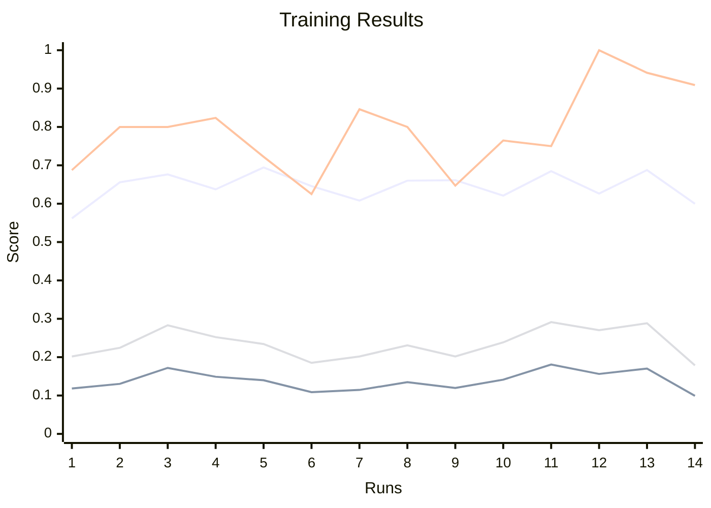

# A rules-based approach to entity extraction from Latin texts

The code in this repository is designed to extract structured information (entities and their relationships) from Medieval Latin texts, leveraging both linguistic rules (via chunking) and machine learning. It is particularly tailored for historical or philological research, where both precision (via rules) and adaptability (via ML) are valuable. The two main Jupyter notebooks, `chunk_text.ipynb` and `train_model.ipynb`, form the core of the workflow.

## 1. Rule-Based Chunking and Preprocessing

Implemented in `chunk_text.ipynb` this step preprocesses the raw Latin text, applying rule-based chunking, and generating HTML-based visualizations to verify the results.

Corpus data is loaded from `data/lines_clean_dev.txt`. The chunking relies on a sample of manually-annotated tags including a gloss dictionary, noun, and proper noun lists, and measurement units from the `data` directory. The workflow uses the Stanza NLP library to tokenize, lemmatize, and POS-tag the corpus. It applies custom overrides to POS tags and features based on the loaded dictionaries and some hardcoded rules (e.g., marking certain words as objects, units, or locations).

Pre-defined chunking rules are loaded from `chunk_rules.chk` into an NLTK RegexpParser grammar and each sentence is parsed into a chunk tree according to them. The rules are quite involved and hard to read, so I developed a [Tree-sitter parser for NLTK chunk syntax](https://github.com/gpizzorno/tree-sitter-chunk-grammar) and a [syntax highlighting module for Atom](https://github.com/gpizzorno/atom-language-chunkgrammar) to help.

Custom visualization functions convert the chunked sentences into HTML, mapping chunk labels to colors and descriptions (see the key and colours dictionaries). The HTML is saved as `chunks.html` to the `results-viz` directory for inspection. A shallow chunking step simplifies the trees to only keep top-level (level 1) tags, mapping detailed chunk labels to broader categories (e.g., `OP` to `OBJECT`). The shallow trees are saved to `parsed_sentences_shallow.pickle` and visualized in `chunks_shallow.html`.

### Visualization example:

    

        
1

        

            
Et

            

                
 pList

                

                    
primo

                

            

            

                
 pCtx

                

                    

                        fuerunt

                    

                        inventa

                

            

            

                
 pLoc

                

                    
in

                

            

            

                
 LOC-rm

                

                    

                        coquina

                

            

            

                
 LOC-lm

                

                    

                        domus

                

            

            

                
 pRef

                

                    

                        dicti

                

            

            
Guillelmi

            

                
 ATT-Adj

                

                    
hec

                

            

            
bona

        

    

    

        
3

        

            
Item

            

                
 OP

                

                    

                        
 QT

                        

                            

                                unum

                        

                    

                    

                        
 OBJ

                        

                            

                                scudellium

                        

                    

                

            

        

    

## 2. Machine Learning-Based Chunking
In `train_model.ipynb`, we take the output of the rule-based chunker and train a machine learning model to perform chunking/entity extraction.

The shallow chunked trees produced by `chunk_text.ipynb` are converted into IOB ([Inside-Outside-Beginning](https://en.wikipedia.org/wiki/Inside–outside–beginning_(tagging))) format. The results are saved to `results/chunks_iob.txt`.

A rich `Feature Extraction` function is defined that, for each token, considers:

- The word, lemma, POS tags, and grammatical features.
- Contextual information from neighboring tokens (previous/next words, tags, lemmata).
- Custom features such as capitalization, object/unit/location markers, etc.

The workflow implements a custom NLTK chunker class (`NamedEntityChunker`) that uses a [ClassifierBasedTagger](https://www.nltk.org/api/nltk.tag.sequential.html#nltk.tag.sequential.ClassifierBasedTagger) trained on the extracted features.

The model is then trained, persisted to disk as `models/chunking_model.pickle`, and its performance is evaluated:

## 3. Supporting Files and Directories

- `data`: Contains dictionaries and lists (glosses, nouns, proper nouns, measurement units) used for tagging and feature extraction.
- `rules`: Contains the rule-based chunking grammars.
- `results`: Stores intermediate and final outputs (lemmata, parsed sentences, IOB tags).
- `results-viz`: Contains HTML visualizations and CSS for inspecting chunking results.
- `models`: Stores the trained machine learning chunker.

## License
The project is licensed under the MIT License (LICENSE), allowing free use, modification, and distribution. See the LICENSE file in the top distribution directory for the full license text.

